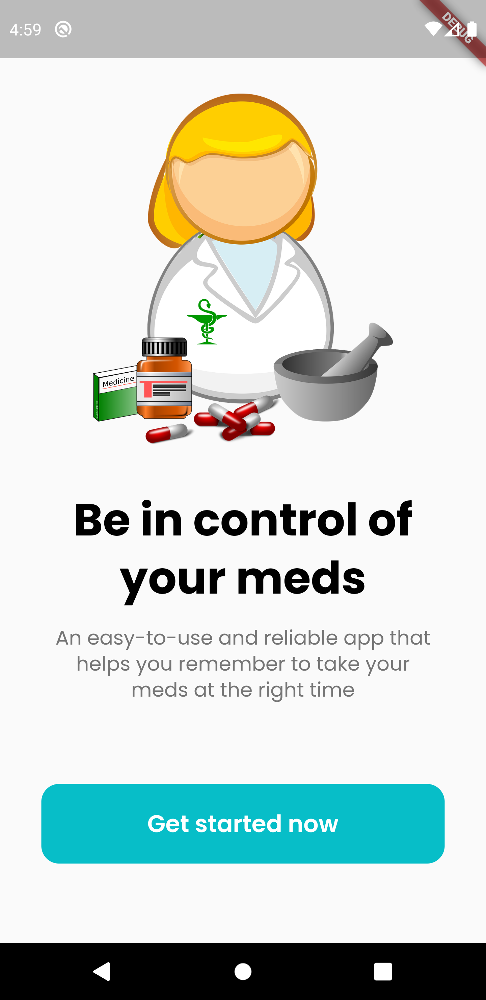
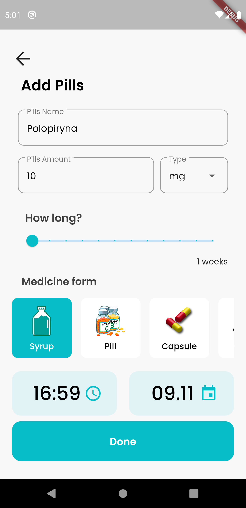
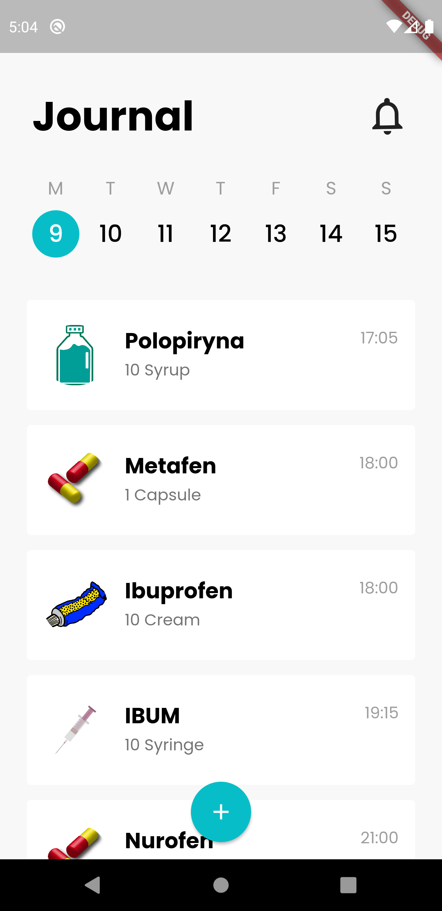
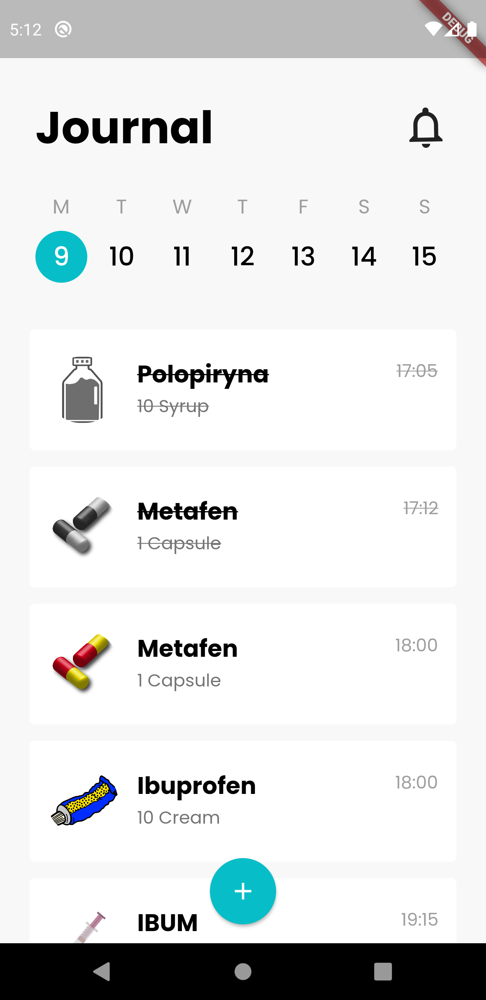
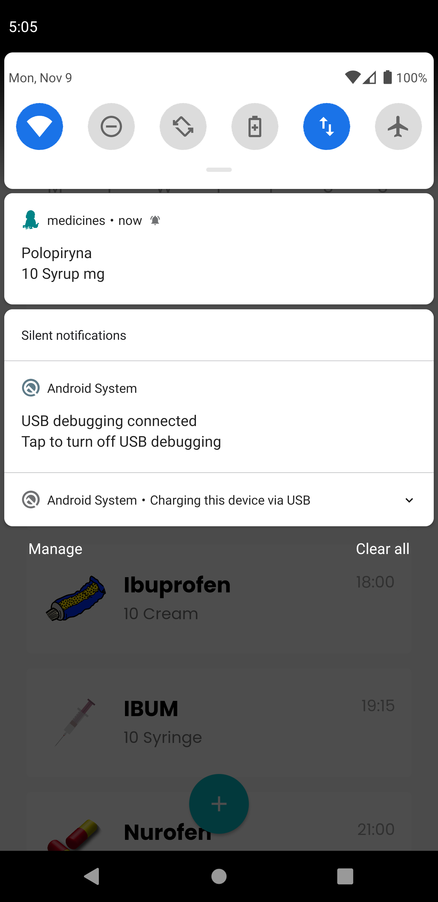

## **Medicines App**

#### A Flutter application, which you can save medicines and app will be send remind when you have to take it :bell:

A few resources to get you started if this is your first Flutter project:

- [Lab: Write your first Flutter app](https://flutter.dev/docs/get-started/codelab)
- [Cookbook: Useful Flutter samples](https://flutter.dev/docs/cookbook)

For help getting started with Flutter, view our
[online documentation](https://flutter.dev/docs), which offers tutorials,
samples, guidance on mobile development, and a full API reference.

### App branches :

| Branch Name | Feature | Link |
| :---:         |     :---:      |         :---: |
| master   | notifications, details, setup app     | [master](https://github.com/F-Y-E-F/Medicine-App-In-Flutter)   |
| feature/setup_database   | setup local sqflite database  | [feature/setup_database](https://github.com/F-Y-E-F/Medicine-App-In-Flutter/tree/feature/setup_database)   |
| feature/routes   | setup navigation     | [feature/routes](https://github.com/F-Y-E-F/Medicine-App-In-Flutter/tree/feature/routes)   |
| feature/home_screen   | create home screen ui    | [feature/home_screen](https://github.com/F-Y-E-F/Medicine-App-In-Flutter/tree/feature/home_screen)   |
| feature/add_pill_screen  | create add pill screen ui    | [feature/add_pill_screen](https://github.com/F-Y-E-F/Medicine-App-In-Flutter/tree/feature/add_pill_screen)   |

### Used Techology:

- flutter cupertino icons :iphone: [link](https://pub.dev/packages/cupertino_icons)
- flutter intl :calendar: [link](https://pub.dev/packages/intl)
- flutter sqflite :clipboard: [link](https://pub.dev/packages/sqflite)
- flutter auto size text :memo: [link](https://pub.dev/packages/auto_size_text)
- flutter path :rocket: [link](https://pub.dev/packages/path)
- flutter local notifications :bell: [link](https://pub.dev/packages/local_notifications)
- flutter timezone 	:clock1230: [link](https://pub.dev/packages/timezone)
- flutter animated text kit :memo: [link](https://pub.dev/packages/animated_text_kit)
- flutter animated widgets :eye_speech_bubble: [link](https://pub.dev/packages/animated_widgets)

### App features :
- [x] Save medicines in local database
- [x] Show notification in correct time
- [x] Delete medicines

### Screenshots :

